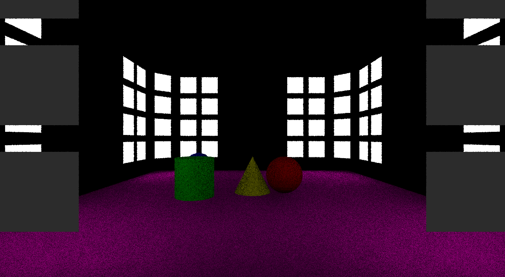

# ReSTIR
An implementation of [spatiotemporal reservoir resampling](https://research.nvidia.com/publication/2020-07_Spatiotemporal-reservoir-resampling) 
algorithm with c++/Vulkan.



# System requirements
- GNU/Linux distribution
- GPU that supports Vulkan Raytracing
- GPU driver that supports finalized raytracing API

# Build Prerequisites
- Clang version with C++20 support (tested with 11.1.0)
- GNU Parallel and glslangValidator in PATH for shader compilation

# Build on adequate systems

Note: GCC built Conan dependencies work fine

```
mkdir build
cd build
conan install .. # --build=missing
cmake .. 
# cmake -DCMAKE_BUILD_TYPE=Debug .. # for debug (duh...)
make

# ../slow_recompile_shaders.sh
# or
# ../recompile_shaders.sh # to build shaders if CMake didn't for some reason
```

# Build on Windows

Firstly you need Visual Studio BuildTools with Clang Tools installed. 
There is no way to supress warnings from Conan dependencies, so prepare to get bamboozled. 
You may also opt into building these with `compiler.toolset=ClangCL` set in profile settings
and `set(CONAN_DISABLE_CHECK_COMPILER OFF)` in `CMakeLists.txt`, but the result is the same.

```
mkdir build
cd build
conan install .. # --build=missing
cmake .. -G "Visual Studio 16" -T"clangcl" 
cmake —build . —config Release
```

You may install Vulkan SDK for convenient access to glslangValidator. 
To build shaders open `build` directory with `git-bash` and

```
../slow_recompile_shaders.sh
```

Do NOT run the scripts by double-clicking or Windows native prompts.

# Run

Just double-click the executable

# Controlls

- W/A/S/D - strafe
- Q/E - turn left/right
- Backspace/Enter - levitate downwards/upwards

# CLI options
Default is `./neo -m ReSTIR -N 1 -M 4`

-  -h,--help                   Print this help message and exit
-  -N,--N UINT                 Number of samples per pixel
-  -m,--method TEXT            Which shader to use
-  -c,--capture                Capture screenshot
-  -o,--offline                Quit after rendering the screenshot
-  -a,--accumulate             Stitch frames together
-  -f,--frames UINT            Number of frames to concatenate
-  -t,--tolerance UINT         Number of frames before capturing
-  -M,--M UINT                 M value for RIS
-  -i,--immediate              Unlock FPS

# EXTRA
`shaders/extra` folder contains several other shaders for debug and comparison. 
You may want to test the perfomance and quality with other explicit sampling strategies:

```
$ time ./neo -m ReSTIR -N 1 -M 4 -ocf 16
$ time ./neo -m extra/shadowrays_const -N 8 -ocf 16
```
